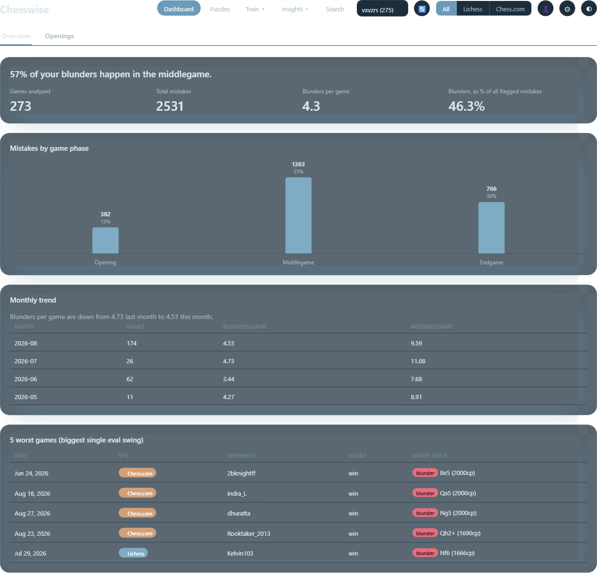
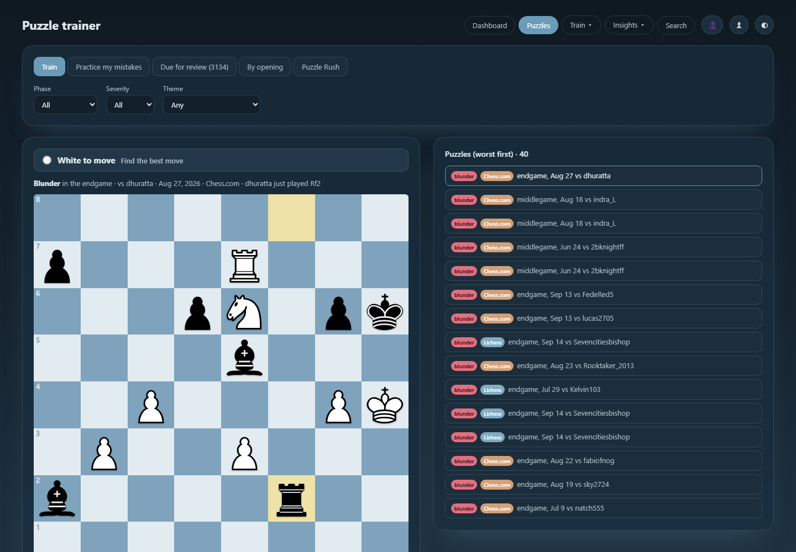

# Chesswise

[](https://github.com/alexandrio1710/chesswise/actions/workflows/tests.yml)
[](LICENSE)

Pulls your own game history from Lichess and/or Chess.com, runs every game
through Stockfish, and surfaces *patterns* in your mistakes instead of just
raw engine analysis of one game at a time — where you're actually losing
value (which phase, which openings, how time pressure affects you), a
tactics trainer built from your own real blunders, and month-over-month
trend tracking.




## Features

- Fetches and normalizes games from both Lichess and Chess.com into one
  internal shape
- Classifies every move by severity (inaccuracy / mistake / blunder) and
  game phase (opening / middlegame / endgame)
- A dashboard: mistakes by phase, worst games, monthly trend, and an
  openings view (win rate and mistake rate by opening family, ranked by
  impact)
- A puzzle trainer generated from your own flagged mistakes — find the
  move you missed, see the engine's top lines, with a "practice my
  mistakes" mode that prioritizes your biggest leak
- An optional weekly Discord digest
- Runs entirely locally: SQLite file, no external services required
  (Discord is opt-in)

## Setup

**Requirements:** Python 3.12+, and a Stockfish binary (a separate install,
not a Python package).

1. **Clone and install dependencies**

   ```
   git clone https://github.com/alexandrio1710/chesswise.git
   cd chesswise
   python -m venv venv
   venv\Scripts\activate          # Windows
   source venv/bin/activate       # macOS/Linux
   pip install -r requirements.txt
   ```

2. **Install Stockfish**

   ```
   # Windows
   winget install Stockfish.Stockfish

   # macOS
   brew install stockfish

   # Linux
   sudo apt install stockfish
   ```

   The app auto-detects it (PATH, then common install locations). If it
   can't find it, set `STOCKFISH_PATH` in your `.env`.

3. **Configure `.env`** (optional — everything has a sensible default)

   ```
   cp .env.example .env
   ```

   Fill in whatever you need — your usernames, a Discord webhook URL if
   you want the digest, or tuning knobs like `STOCKFISH_DEPTH`. See
   `.env.example` for the full list.

4. **Run it**

   ```
   cd app
   python cli.py fetch --lichess-user yourname --chesscom-user yourname
   python cli.py analyze
   python cli.py puzzles
   python cli.py serve
   ```

   Then open http://127.0.0.1:8000.

## Usage

Everything goes through `python cli.py <command>` (run from the `app/`
directory). `python cli.py <command> --help` shows each command's own
options.

| Command | What it does |
|---|---|
| `fetch` | Pull recent games for one or both sites and store them (a full pull, not incremental). `--lichess-user`, `--chesscom-user`, `--max-games` |
| `analyze` | Run Stockfish analysis on every stored game that hasn't been analyzed yet. `--depth` (speed/accuracy tradeoff), `--workers` (parallel processes) |
| `refresh` | `fetch` (incremental — only games newer than what's stored) + `analyze` in one step. Remembers your usernames after the first run, so later calls need no arguments |
| `puzzles` | Generate tactics puzzles from every flagged mistake/blunder that doesn't have one yet |
| `digest` | `refresh` + `analyze` + post a summary to a Discord webhook (`DISCORD_WEBHOOK_URL` in `.env`, or `--webhook-url`) |
| `serve` | Start the local dashboard (`--host`, `--port`, `--reload` for development) |

Re-running any command is always safe — games are deduped, already-analyzed
games are skipped, and puzzles aren't regenerated for mistakes that already
have one.

**Scheduling the digest**: `cli.py digest` only runs when triggered; wire it
up with cron (`crontab -e`) or Windows Task Scheduler if you want it weekly.

## Development

```
pip install -r requirements.txt -r requirements-dev.txt
pytest -v
```

Tests run automatically on every push via GitHub Actions.

## Deployment

The app runs cleanly anywhere Python + Stockfish are available — that's
the whole local setup above. A `Dockerfile` is included for deploying to
Fly.io, Railway, or any other container host:

```
docker build -t chesswise .
docker run -p 8000:8000 chesswise
```

**Persistence matters**: the SQLite database lives inside the container by
default and is lost on every redeploy/restart unless you mount a
persistent volume and point `DB_PATH` at a path inside it. `fly.toml.example`
has a starting point for Fly.io (`flyctl launch`, `flyctl volumes create`,
then `flyctl deploy`) — rename it to `fly.toml` after filling in your app
name. Whichever platform you use, set your `.env` values as that
platform's secrets/environment variables rather than committing `.env`.

`GET /health` reports basic status (game counts, last analysis run) without
exposing any personal data — a quick way to confirm a deployed instance is
alive.

## Roadmap

Ideas for later, not committed to any particular order:

- Spaced-repetition tracking for puzzles (which ones you've solved, missed,
  and should see again)
- Lichess/Chess.com OAuth so this could run as a shared multi-user service
  instead of one local DB per person
- A proper ECO opening database, so opening-family grouping doesn't rely on
  the string heuristics it uses today
- Push notifications / mobile app wrapper around the dashboard

## License

MIT — see [LICENSE](LICENSE).
